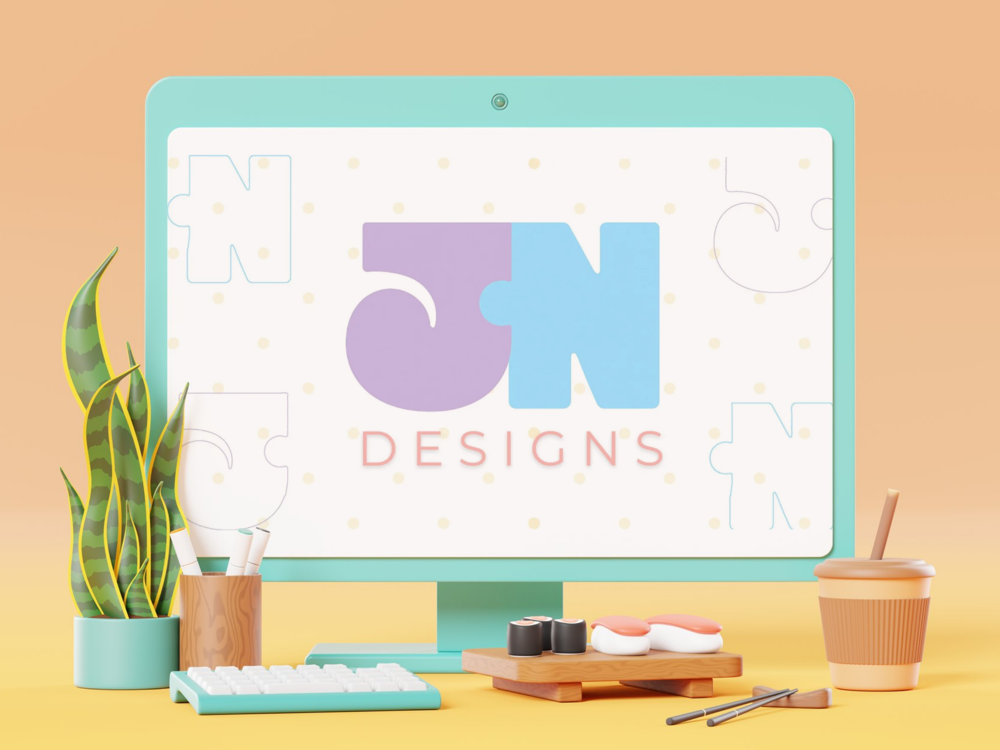

The Portfolio of Justine Nathalie Ng - Interactive Media Designer

Welcome to my personal portfolio repository! This portfolio showcases my creative journey, skills, and projects as an Interactive Media Design student. Here, you’ll find a collection of works that reflect my strengths in design, motion, and product development — blending creativity with interactivity to create meaningful digital experiences.

Table of Contents 
About 
Skills 
Features 
Installation 
Contact 

About 

This portfolio was created to demonstrate my growth in both creative and technical fields. From designing interactive websites to developing new product ideas, I explore different ways to bring stories and experiences to life. Each project shows how I approach challenges with a balance of creativity, design thinking, and problem-solving.

Skills 
Here’s a quick overview of the skills highlighted in this portfolio:
Creative & Design
Motion Design & Animation
Graphic & Web Design
Product & Brand Development
Technical

### Languages:  
JavaScript, HTML5, CSS3

### Frameworks and Libraries: 
GreenSock

### Tools: 
Git & Github, Figma, Adobe Suite

### Technologies: 

Features 
Responsive Layout across mobile, tablet, and desktop
Organized SASS styling with variables and partials
Smooth hero animations and scroll-triggered effects
Interactive navigation with burger menu toggle
Fun drag-and-drop features on About and Skills pages

Installation 
To run the portfolio locally:
Clone this repository
Navigate into the project folder
Open the index.html file in your browser, or launch via a local server

Contact
I’d love to connect! Whether you’d like to collaborate, ask a question, or just say hello, feel free to reach out:

LinkedIn: [Justine Nathalie Ng](www.linkedin.com/in/jnathalieng)

Thank you for visiting my portfolio! 